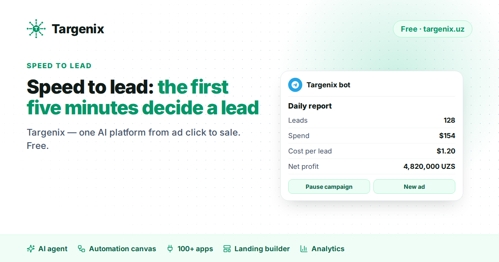

# Speed to lead: why the first five minutes decide a Facebook lead

Every media buyer in Tashkent has heard the same complaint from a sales team: "the leads are bad." Very often the leads are fine. They are simply old by the time anyone calls.

A person who fills in a Facebook or Instagram lead form is thinking about your product for a few minutes. After that they are back in their feed, watching a competitor's ad, or answering a message from a friend. When your operator calls two hours later, the person barely remembers leaving a number. The call goes to voicemail, or it turns into "I will think about it."

## Where the minutes are lost

In most small businesses we talk to, a lead passes through three slow steps before a human sees it:

1. **Export.** Someone opens Meta Business Suite and downloads a CSV, once in the morning and once after lunch.
2. **Copying.** The rows are pasted into a spreadsheet or a CRM by hand. Duplicates and typos appear here.
3. **Assignment.** A manager decides who calls whom and sends the list to the team chat.

Each step looks small. Together they turn a two-minute-old lead into a four-hour-old lead.

## What "instant" actually looks like

Removing those steps is not complicated. The lead form sends an event the moment it is submitted; a system that listens for that event can put the lead where the sales team already works:

- a **Telegram group** of operators, where the first person to react takes the call;
- a **CRM** such as Bitrix24, amoCRM/Kommo or HubSpot, with the ad and campaign name attached;
- a **Google Sheet** for small teams that do not use a CRM yet.

With [Targenix](https://targenix.uz/en) this happens on average in under a second, to every connected destination at once — any of 100+ apps. If a destination is down, the delivery is retried automatically and shown in a log, so a lead is never silently lost.

## Not every lead fills in a form

A growing share of buyers never touch the form. They write "price?" under the ad or send a DM. These conversations are leads too, and they go cold even faster than form submissions, because the person expects a chat-speed answer.

This is where AI helps. The Targenix AI sales agent works 24/7 in ad comments, Instagram Direct and Messenger: it answers questions about price and delivery from the business's own knowledge — its texts, website pages and catalog — asks for a phone number and creates a lead in the same CRM or Telegram group. Hard questions go to a person. The operator starts the call with context instead of a cold number.

## A simple checklist

- Measure the time between form submission and the first call for one week. Most teams are surprised.
- Send new leads to the place your operators already look at all day — usually Telegram.
- Treat comments and DMs as leads, not as "social media."
- Send a test lead before you launch a campaign, not after the first complaint.

## Targenix today

Targenix is one AI platform from ad click to sale, and it is free — no subscription, no card, AI included. Setup takes about five minutes without code. In one account:

- leads from forms and landing pages in Telegram, a CRM or Google Sheets in under a second, through any of 100+ apps;
- a 24/7 AI sales agent for comments and DMs in Instagram and Facebook;
- Telegram control: loss alerts with a Pause button and a daily profit report;
- an automation canvas, a landing page builder with 200+ templates and ad and profit analytics.

Read more: [Telegram control](https://targenix.uz/en/features/telegram-bot) · [AI sales agent](https://targenix.uz/en/features/ai-sales-agent) · [100+ apps](https://targenix.uz/en/integrations)

---

More from Targenix: [Conversions API guide](https://xuseyinoff.github.io/targenix-guides/) · [Comparison with Zapier, Make, ManyChat](https://targenix.uz/en/tools) · [Targenix in English](https://targenix.uz/en)
